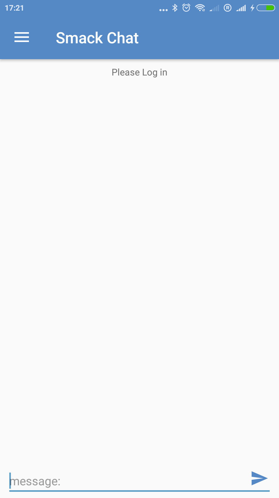
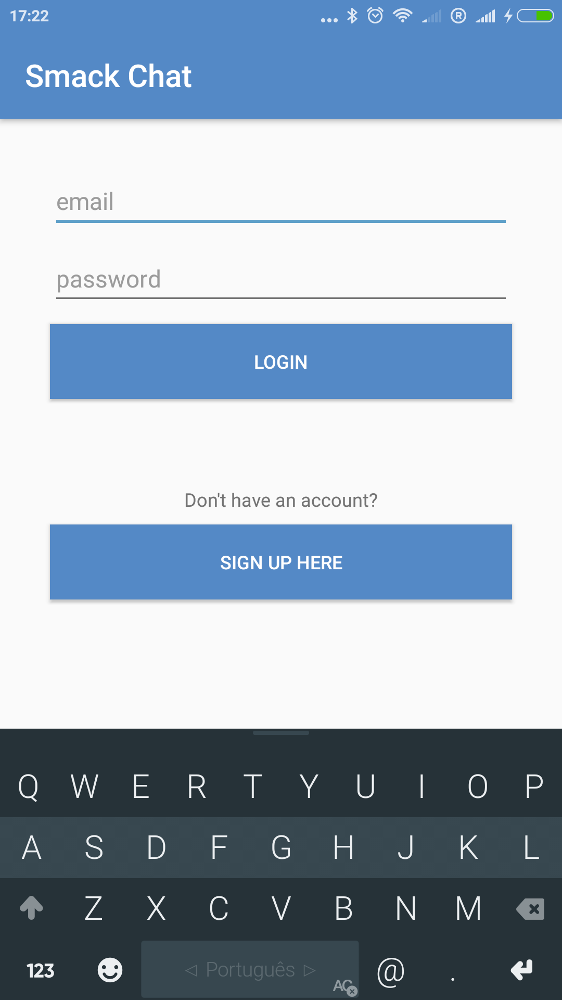
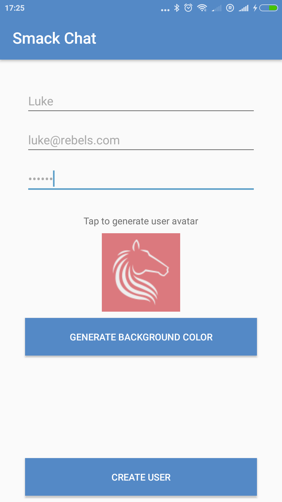
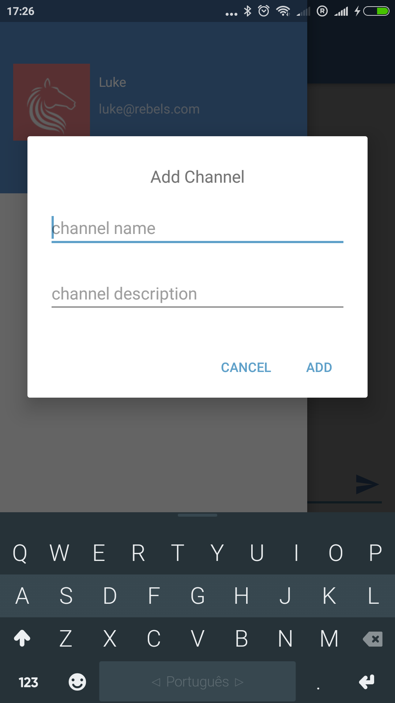
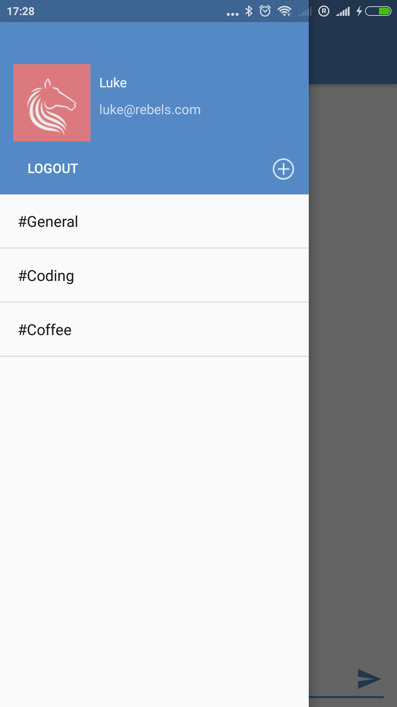
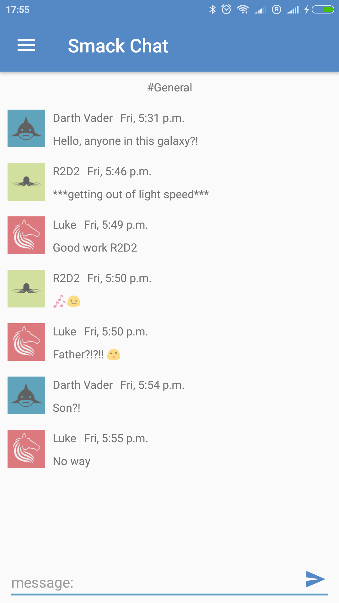
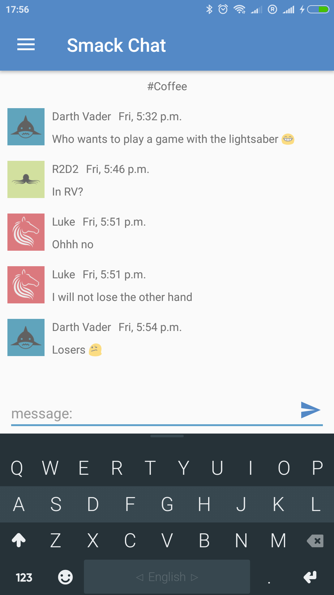

# Smack Chat

A chat app for sending messages with channels. Using an API hosted in Heroku with a MongoDB database hosted in mLab.

## Info

All the user profile, message and channels are saved in the database. The login / register is done by sending the web request using the Volley library. For the message and channels, all the communication between the client and the API is done by sockets, namely Socket.IO without being always necessary to send the auth token.

This is a simple chat app only with the purpose of learning. All the users can send and receive messages in real time for any channel. It's also possible to create channels.

## Libraries, APIs and Hostings

+ **Heroku with Chat API** - Cloud Application Platform with the API
+ **mLab** - MongoDB hosting
+ **Volley** - HTTP library
+ **Socket.IO** - Sockets library
+ **Shared Preferences** - Key-value pairs API 

## Not taken into account

+ Testing

## Screenshots

